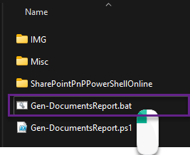
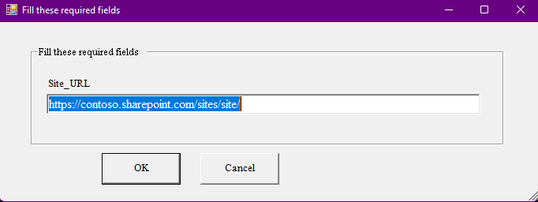

# SPO Documents Report
SPO Documents Report is a script that generates a CSV file that lists all files in a target site.

## Limitations
- The report does not include subsites.
- The report can only targe tone site at a time.

## Prepare workstation
Before you begin, make sure you are running this script on a modern machine with Windows 10 or later. This script is not tested against older operating systems.

Additionally, verify that the target SharePoint site  already exists. 

- Launch a new PowerShell window:


- Run the following PowerShell command to allow running scripts:

```
Set-ExecutionPolicy -Scope CurrentUser Unrestricted
```

- Unzip the folder and confirm the contents.
- Run `Gen-DocumentsReport.bat` file by double-clicking it:



- Provide a SharePoint site URL that will contain email archive:

- Click OK.
- Login to the SharePoint Online Site
- After the script is done, a CSV file will be created in the script folder.


## Can I run the script multiple times?
You can run the script multiple times. Every time you run it, a new CSV file will be created with a name of a site you target.